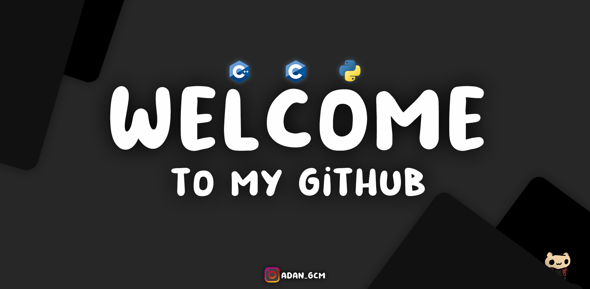

### Hola 👋



## Sobre mi
- Soy un estudiante de Universidad Autonoma de Baja California
- Actualmente estoy cursando una carrea de ingenieria en software y tecnologias emergentes
- i speak a little bit of english, just a little bit
  


### Lenguajes que manejo

``` 
    #include <iostream>

    using std::cout;
    using std::endl;

    int main()
    {
        cout<<"Estoy comenzando a usar c++"<<endl;
        return 0;
    }
```
``` 
    #include <stdio.h>

    int main()
    {
        printf("Manejo C");
        return 0;
    }
```
``` 
    print("Y un poco de python")
```

### Manejo un poco de HTML y Css

### Datos extra
- 🥶 Integrante de Only Codes
- 🎬 Editor de videos como hobby
