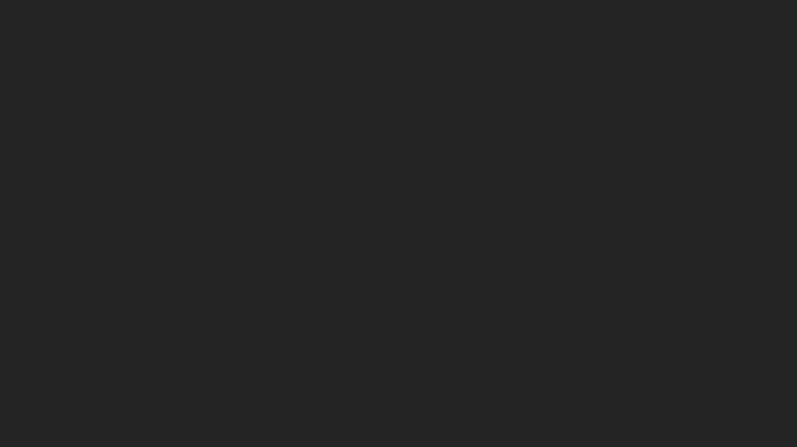

<<<<<<< HEAD

    <a href="https://adancc21.github.io/Web/" style="font-size:30px;"> Portafolio </a>

---
=======
# [Portafolio](https://adancc21.github.io/Web/)

>>>>>>> 366c5d20b6c74f6db50ace0e960a683b2ed6b262
## Sobre mi
- Soy un estudiante de Universidad Autonoma de Baja California
- Actualmente estoy cursando una carrea de ingenieria en software y tecnologias emergentes
- i speak a little bit of english, just a little bit

### Datos extra
- 🥶 Integrante de Only Codes
- 🎬 Editor de videos como hobby
- Quiero aprender JavaScript y Kotlin

